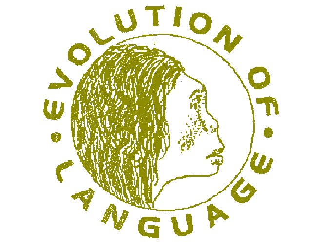
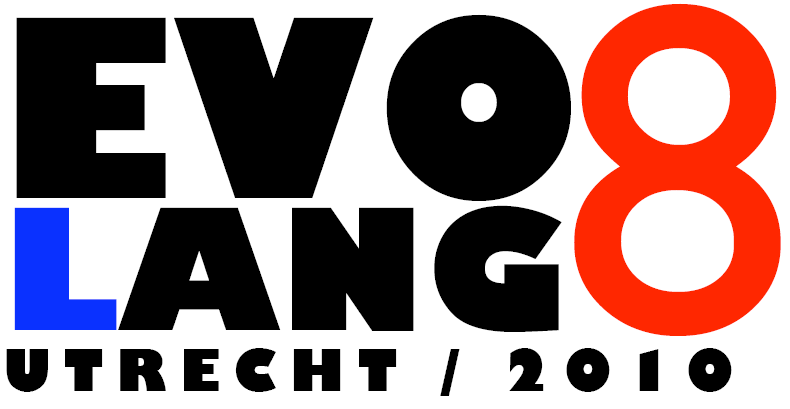

The Evolution of Language conferences (a.k.a. Evolang) is a series of biennial conferences, that started in 1996 with the first edition in Edinburgh, U.K. Since that time the conferences have become bigger and more professional with every edition, and have firmly established themselves as the major conference for research on the origins of language. Evolang is not organized through any existing formally constituted body, but by an evolving organizing committee consisting of some past local organizers and some past editors of publications arising from the conferences.

**Evolang 1, 1996:** The (so-called) First International Conference on the Evolution of Language was hosted by the University of Edinburgh in April 1996. The main instigators were Chris Knight and Jim Hurford. A book resulting from the conference appeared later -- 1998 Approaches to the Evolution of Language: social and cognitive bases, edited by James R Hurford, Michael Studdert-Kennedy and Chris Knight. Cambridge University Press. See: <http://www.infres.enst.fr/confs/evolang/edinbook.html>

**Evolang 2, 1998:** After the first conference there was a consensus that we should do it again, but not too often. Thus the biennial routine was set. The Second International Conference on the Evolution of Language was hosted by the University of East London in April 1998, with Chris Knight as local organizer. A book resulting from the conference appeared later -- 2000 The Evolutionary Emergence of Language: Social function and the origins of linguistic form, edited by Chris Knight, Michael Studdert-Kennedy and James R Hurford. Cambridge University Press. See: <http://www.infres.enst.fr/confs/evolang/Londonbook.html>.

**Evolang 3, 2000:** This took place in Paris, organized locally by Jean-Louis Dessalles, at the Ecole Nationale Supérieure des Télécommunications (ENST). The book emerging from this conference was edited by Alison Wray, titled The Transition to Language, published by Oxford University Press (2002). This conference marked a significant upgrade in professional management. For the programme, see: <http://www.infres.enst.fr/confs/evolang/program.html>.

**Evolang 4, 2002:** This was at Harvard University, Cambridge, Massachusetts, organized locally by Tecumseh Fitch. For details, see: <http://www.ling.ed.ac.uk/evolang/2002/>. The book to emerge from this conference was edited by Maggie Tallerman, titled Language Origins: Perspectives on Evolution, published by Oxford University Press (2005).

**Evolang 5, 2004:** This was hosted by the Max Planck Institute for Evolutionary Anthropology, Leipzig, and locally organized by Bernard Comrie. For details, see: <http://www.ling.ed.ac.uk/evolang/2004/>. Though the conference was a success, no book publication ensued. This was the first conference in the series at which the acronym Evolang became current.

**Evolang 6, 2006:** This was held at the University of Rome “La Sapienza”, locally organized by Angelo Cangelosi. For details, see: <http://www.tech.plym.ac.uk/socce/evolang6/>. At this conference, a full book of all the submitted papers was produced and circulated at the conference. It was produced and published by World Scientific (Singapore) with the title 'The Evolution of Language', edited by Angelo Cangelosi, Andrew Smith and Kenny Smith.

**Evolang 7, 2008:** This was held at the CosmoCaixa (Museum of Science) in Barcelona, locally organized by Ramon Ferrer i Cancho of the Universitat de Barcelona. For details, see: <http://stel.ub.edu/evolang2008/>. As for the previous conference, a full book of all the submitted papers was produced and circulated at the conference. It was produced and published by World Scientific (Singapore) with the title 'The Evolution of Language', edited by Ramon Ferrer i Cancho, Andrew Smith and Kenny Smith.

**Evolang 8, 2010:** This was hosted by Utrecht Institute of Linguistics OTS (UiL OTS) of Utrecht University, and was locally organized by Martin Everaert and Rudolf Botha. Details of the conference are available at: <http://www.illc.uva.nl/LaCo/evolang/>

**Evolang 9, 2012:** This was hosted by the University of Tokyo, but was held in Kyoto. The local organizer was Kazuo Okanoya. Details of the conference are available at: <http://kyoto.evolang.org/>

**Evolang 10, 2014:** This was hosted by the Department of English at the University of Vienna. It was locally organized by Nikolaus Ritt and Andreas Baumann. Details of the conference are available at: <http://vienna.evolang.org/>

**Evolang 11, 2016:** Was hosted in New Orleans, USA. The chair of the local organizing committee was Heidi Lyn. <https://evolang.org/neworleans/>

**Evolang 12, 2018:** Was hosted in Torun, Poland with Sławomir Wacewicz, Przemysław Żywiczyński, and Roland Mühlenbernd as chief organizers. <https://evolang.cles.umk.pl/>

**Evolang 13, 2020:** Was going to be hosted in Brussells with Bart de Boer as chair of the local organizing committee. Sadly it was cancelled due to the pandemic. <https://brussels.evolang.org/>

**Evolang 14, 2022:** Was organized together with Protolang and Evolinguistics, as the Joint Conference on Language Evolution (JCoLE) in Kanazawa, Japan. Organization was headed by Kazuo Okanoya and Rie Asano. <https://sites.google.com/view/joint-conf-language-evolution/home>

**Evolang 15, 2024:** Was hosted in Madison, Wisconsin, USA with Gary Lupyan as the primary local ogranizer. Details are available at: <https://evolang2024.github.io/>.

**Evolang 16, 2026:** Was hosted in Plovdiv, Bulgaria, with Dimitar Kazakov as the primary local ogranizer. Details are available at: <https://sites.google.com/york.ac.uk/evolang2026/home/>
