Since 2006, EVOLANG publishes a proceedings volume that has become fairly prestigious in the field. The proceedings volumes contain six-page full papers and two-page abstracts. Until 2014, the proceedings volumes were circulated as printed books published by World Scientific. All proceedings volumes since 2016 have appeared as open-access volumes and can be found below. The specific licenses for each paper can be found at the bottom of the first page. The proceedings are peer-reviewed, with single-blind peer-review being used until EVOLANG 10 and double-blind peer review from Evolang 11 onwards (see [Roberts & Verhoef 2016](https://doi.org/10.1093/jole/lzw009)).

## Evolang 16, Plovdiv, 2026

Hartmann, Stefan, Marta Sibierska, Marlen Fröhlich, Yannick Jadoul, Mathilde Josserand, Theresa Matzinger, Katie Mudd, Jonas Nölle, Michael Pleyer, Sławomir Wacewicz, Przemysław Żywiczyński. 2026. The Evolution of Language: Proceedings of the 16th International Conference (EVOLANG XVI). The Evolution of Language Conferences 22189. [https://doi.org/10.17617/2.3696655](https://doi.org/10.17617/2.3696655).

<a href="https://evolang.org/2026/proceedings/evolang16_proceedings.pdf">
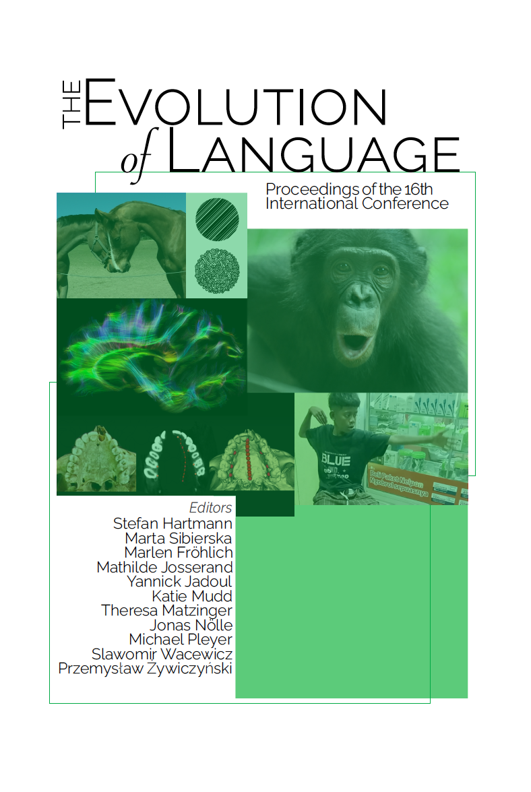
</a>

## Evolang 15, Madison, 2024

Nölle, Jonas, Limor Raviv, Katherine E. Graham, Stefan Hartmann, Yannick Jadoul, Mathilde Josserand, Theresa Matzinger, Katie Mudd, Michael Pleyer, Anita Slonimska, Sławomir Wacewicz, Stuart Watson (eds.). 2024. Proceedings of the International Conference on the Evolution of Language 2024 (Evolang XV). 57214. [https://doi.org/10.17617/2.3587960](https://doi.org/10.17617/2.3587960). 

<a href="https://evolang2024.github.io/proceedings/evolang15_proceedings.pdf">
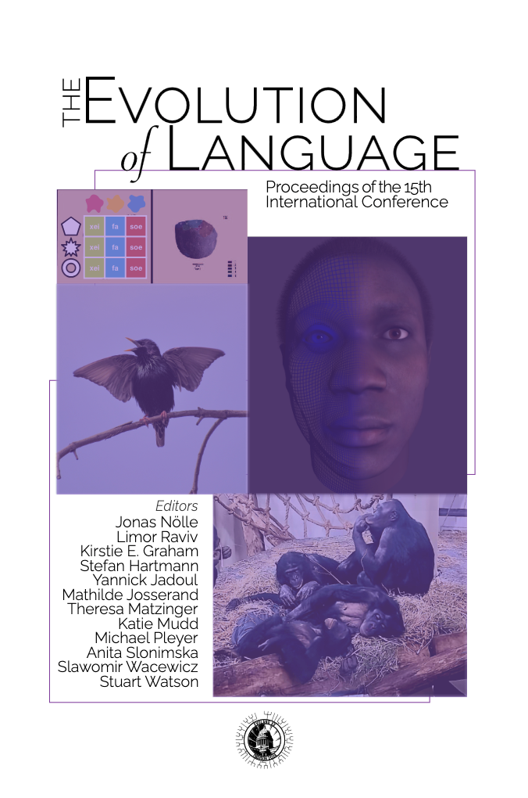
</a>

## Joint Conference on Language Evolution, Kanazawa, 2022

Ravignani, Andrea, Rie Asano, Daria Valente, Francesco Ferretti, Stefan Hartmann, Misato Hayashi, Yannick Jadoul, Mauricio Martins, Yohei Oseki, Evelina Daniela Rodrigues, Olga Vasileva, Sławomir Wacewicz (eds.). 2022. The Evolution of Language. Proceedings of the Joint Conference on Language Evolution (JCoLE). Nijmegen: Max Planck Institute for Psycholinguistics. [https://doi.org/10.17617/2.3398549](https://doi.org/10.17617/2.3398549).

<a href="https://pure.mpg.de/rest/items/item_3398549_12/component/file_3405708/content">
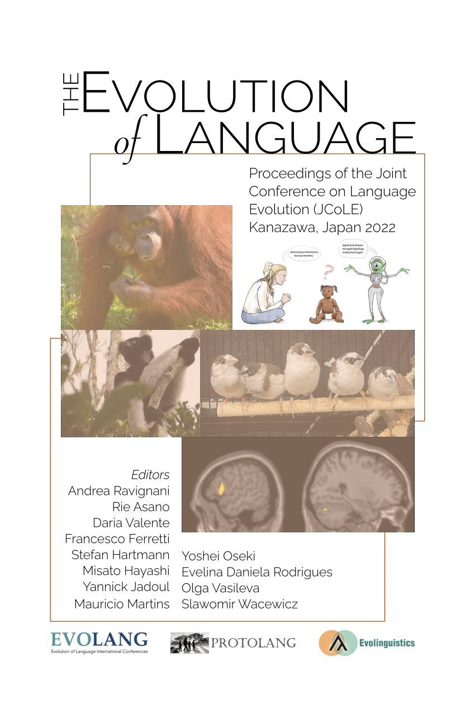
</a>

## Evolang 13, Brussels (cancelled due to Covid), 2020

Ravignani, Andrea, Chiara Barbieri, Mauricio Martins, Molly Flaherty, Yannick Jadoul, Ella Lattenkamp, Hannah Little, Katie Mudd & Tessa Verhoef (eds.). 2020. The Evolution of Language: Proceedings of the 13th International Conference. [https://doi.org/10.17617/2.3190925](https://doi.org/10.17617/2.3190925)

<a href="https://pure.mpg.de/rest/items/item_3190925_17/component/file_3260022/content">
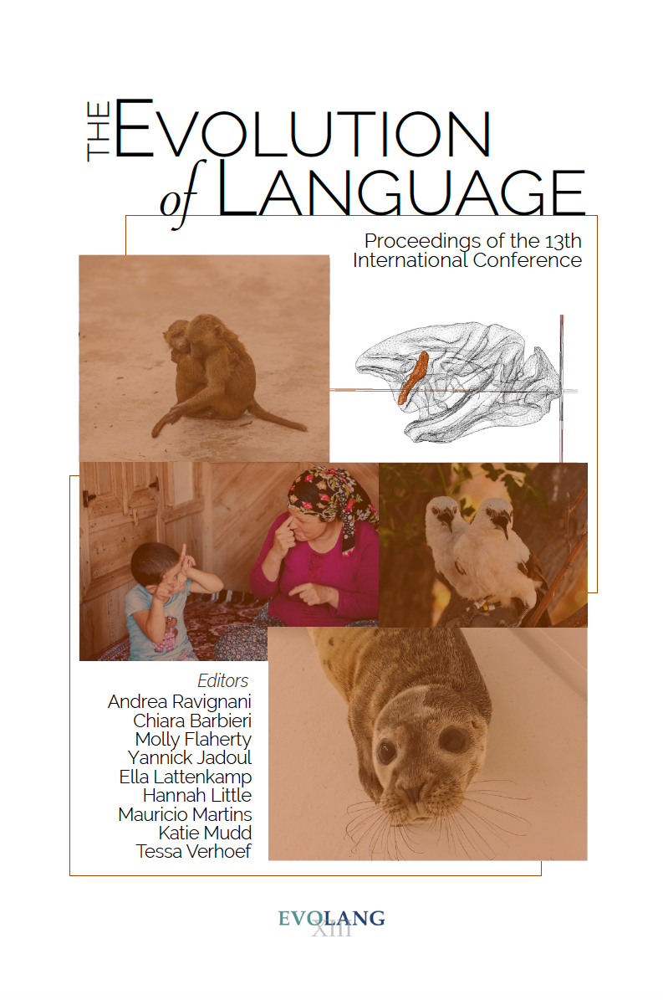
</a>

## Evolang 12, Toruń, 2018 

Cuskley, Christine, Molly Flaherty, Luke McCrohon, Hannah Little, Andrea Ravignani & Tessa Verhoef (eds.). 2018. The Evolution of Language. Proceedings of the 12th International Conference. Toruń: Nicolaus Copernicus University.

<a href="assets/proceedings_volumes/2018 - Evolang12.pdf">
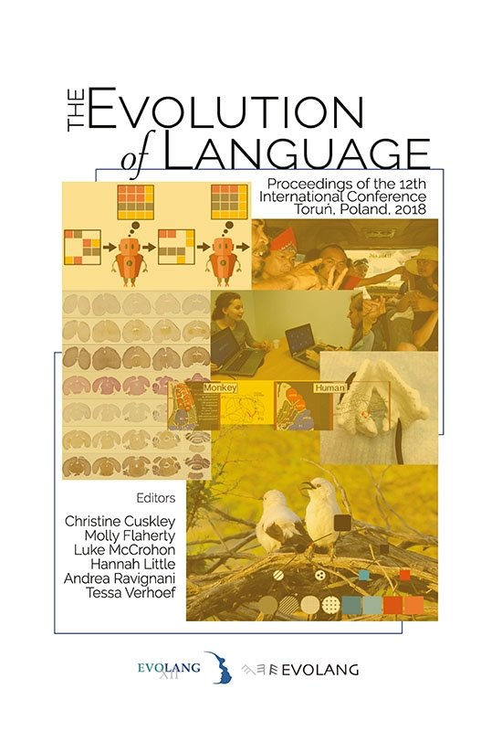
</a>

## Evolang 11, New Orleans, 2016

Roberts, Seán G., Christine Cuskley, Luke McCrohon, Lluís Barceló-Coblijn, Olga Fehér & Tessa Verhoef (eds.). 2016. The Evolution of Language. Proceedings of the 11th International Conference. 

<a href="assets/proceedings_volumes/2016 - Evolang11.pdf">
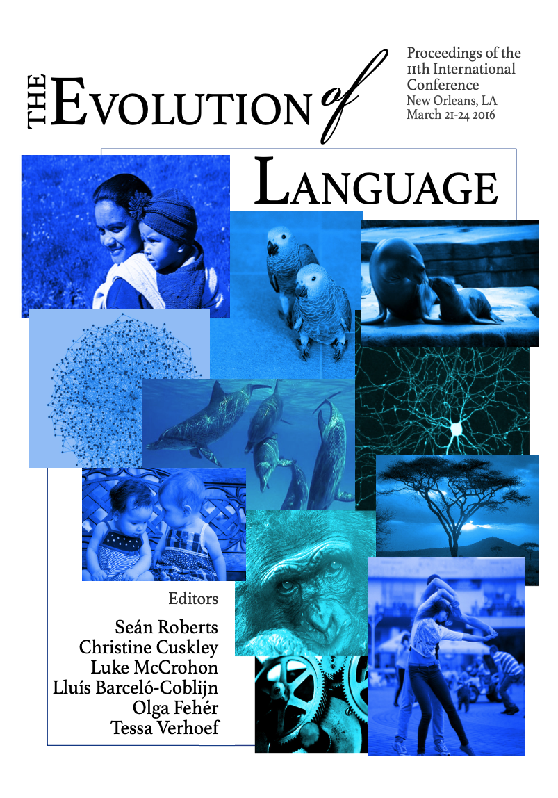
</a>

## Evolang 10, Vienna, 2014

Cartmill, Erica A., Séan Roberts, Heidi Lyn & Hannah Cornish (eds.). 2014. The Evolution of Language: Proceedings of the 10th International Conference. Singapore: World Scientific.

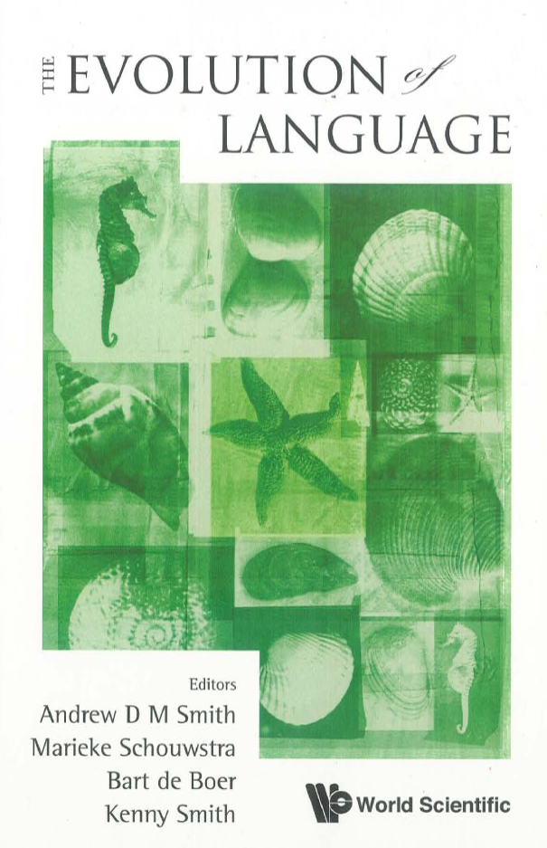

## Evolang 9, Kyoto, 2012

Scott-Phillips, Thomas C., Mónica Tamariz, Erica A. Cartmill & James R. Hurford (eds.). 2012. The Evolution of Language: Proceedings of the 9th International Conference. Singapore: World Scientific.

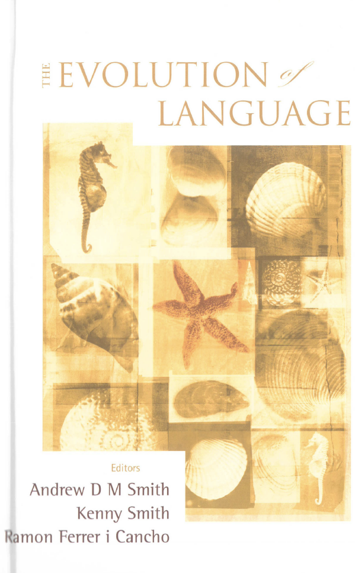

<strong>Evolang 9 student volume:</strong> McCrohon, Luke, Bill Thompson, Tessa Verhoef & Hajime Yamauchi (eds.). 2014. The Past, Present, and Future of Language Evolution Research: Student Volume following the 9th International Conference on the Evolution of Language.

<a href="assets/proceedings_volumes/2012 - Evolang9 Student Volume.pdf">
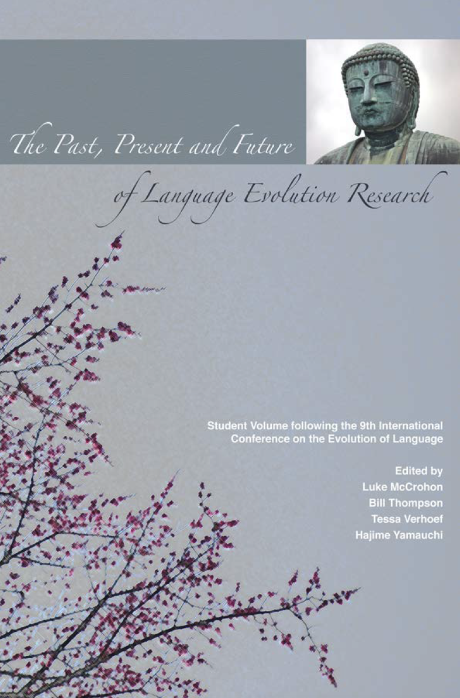
</a>

## Evolang 8, Utrecht, 2010

Smith, Andrew D. M., Marieke Schouwstra, Bart de Boer & Kenny Smith (eds.). 2010. The evolution of language: proceedings of the 8th International Conference (EVOLANG8), Utrecht, Netherlands, 14-17 April 2010. Singapore: World Scientific.

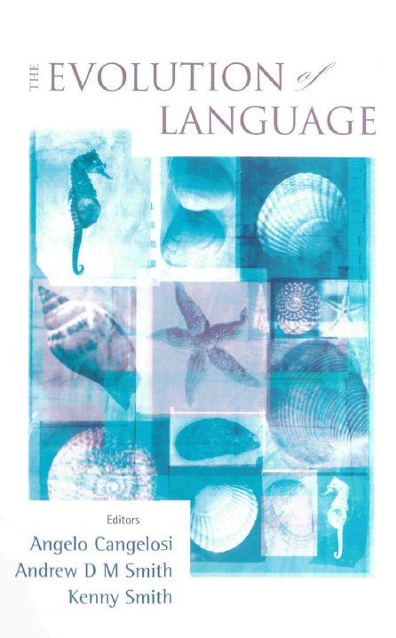

## Evolang 7, Barcelona, 2008

Smith, Andrew D. M., Kenny Smith & Ramon Ferrer i Cancho (eds.). 2008. The evolution of language: proceedings of the 7th International Conference (EVOLANG7), Barcelona, Spain, 12-15 March 2008. Singapore: World Scientific.

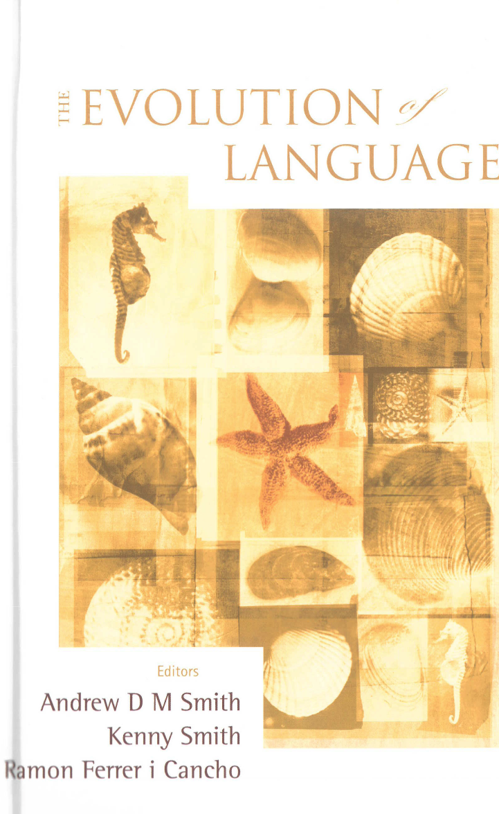

## Evolang 6, Rome, 2006

Cangelosi, Angelo, Andrew D. M. Smith & Kenny Smith (eds.). 2006. The evolution of language: proceedings of the 6th international conference (EVOLANG6), Rome, Italy, 12-15 April 2006. Singapore: World Scientific.

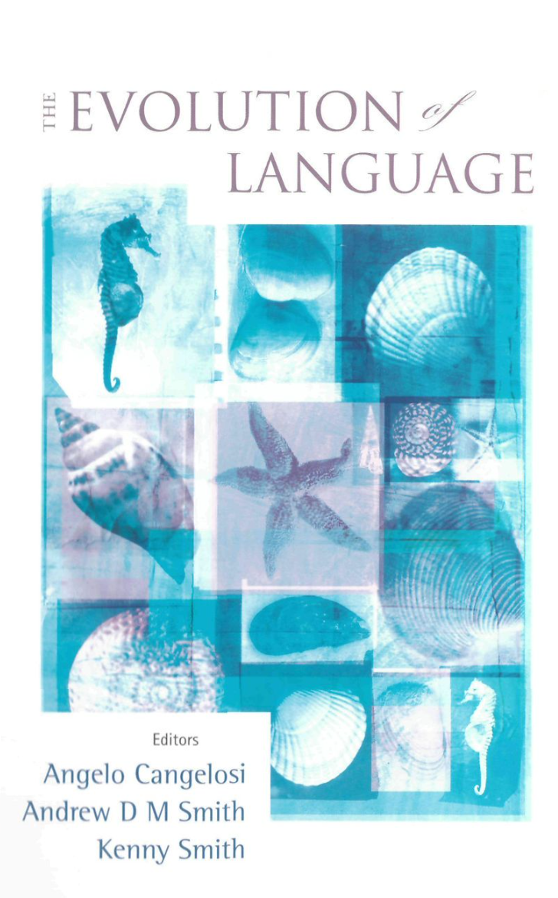